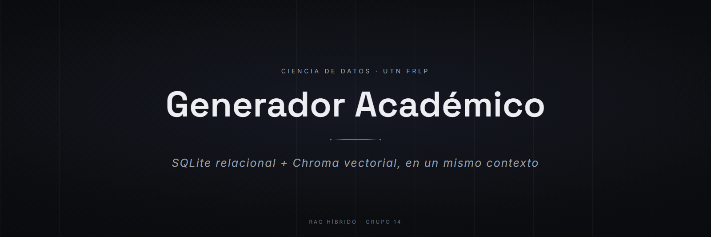
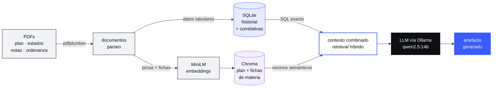

<p align="center">
  
</p>

<p align="center">
  
  
  
  
  
</p>

<p align="center">
  <a href="#cómo-funciona">Cómo funciona</a> &nbsp;•&nbsp;
  <a href="#características">Características</a> &nbsp;•&nbsp;
  <a href="#stack">Stack</a> &nbsp;•&nbsp;
  <a href="#estructura">Estructura</a> &nbsp;•&nbsp;
  <a href="#puesta-en-marcha">Puesta en marcha</a> &nbsp;•&nbsp;
  <a href="#decisiones">Decisiones</a>
</p>

Un modelo de lenguaje no conoce las notas de nadie ni el régimen de correlatividades de la UTN FRLP: son datos privados y de nicho. Este sistema se los da desde dos bases distintas —una relacional con el historial académico real de seis estudiantes, una vectorial con el plan de estudios y las fichas de las 36 materias— y con eso genera planes de cursada, informes de trayectoria y recomendaciones de electivas que citan materias y notas concretas. Proyecto integrador de Ciencia de Datos, UTN FRLP, 2026.

## Cómo funciona



Cada dato va a la base que le corresponde. Lo **tabular** —notas, años, correlatividades— vive en SQLite, donde un `JOIN` responde exacto y la semántica no aporta nada. La **prosa** —diseño curricular, contenidos mínimos de cada materia— vive en Chroma, donde los embeddings encuentran lo que un `SELECT` no puede. El retrieval combina las dos y la generación se ancla solo en lo recuperado.

## Características

- **Persistencia híbrida, no un vector store con todo adentro.** El historial académico se parsea de los PDF del campus a filas de SQLite; el plan de estudios y las fichas de materia se embeben con MiniLM en Chroma. El agente arma su contexto con las dos.
- **Correlatividades reales.** 36 materias obligatorias parseadas de la Ordenanza 1877, más las equivalencias entre los planes 2008 y 2023 (Anexo II). El plan de cursada que sale respeta el régimen, no lo inventa.
- **Seis generadores de artefactos con control de tono.** Plan de cursada, informe de trayectoria, recomendación de electivas y tres más, cada uno con su prompt y su plantilla.
- **Demo con RAG / sin RAG.** El mismo prompt con y sin contexto recuperado, lado a lado: es la forma más directa de mostrar qué aporta el retrieval.
- **Evaluación medida, no declarada.** Grounding léxico y semántico, precisión factual y faithfulness sobre un set de preguntas → `data/eval_resultados.json`.
- **Análisis del corpus.** EDA de las notas, clustering de perfiles de estudiante y proyección de los embeddings de materias, con las figuras regenerables desde `src/figuras.py`.

## Stack

| Capa | Tecnología | Por qué |
|---|---|---|
| Extracción | `pdfplumber` | Los estados académicos del campus son PDF con tablas; hace falta leer celdas, no texto plano |
| Base relacional | `sqlite3` (stdlib) | Notas y correlativas son tabulares: un `JOIN` es exacto y no alucina. Sin servidor que levantar |
| Base vectorial | `chromadb` + all-MiniLM-L6-v2 | El embedding corre local y offline; para un corpus de un plan de estudios no hace falta un servicio |
| Generación | LLM por Ollama | Los datos son privados: el prompt lleva notas reales de seis personas y no sale de la máquina |
| Análisis | `pandas`, `scikit-learn`, `matplotlib` | EDA, clustering de perfiles y las figuras del informe |
| Interfaz | Web app stdlib + `colab/` | Consola en vivo para la demo, notebooks para correr sin instalar nada |

## Estructura

```
src/
  extract.py      PDF → texto (pdfplumber)
  documents.py    Fichas de las 36 materias y el plan de estudios
  db.py           Construcción de la base relacional
  ingest.py       Embeddings + carga en Chroma
  rag.py          Retrieval híbrido: lookup SQL + búsqueda semántica
  generar.py      Los 6 artefactos y el control de tono
  evaluar.py      Grounding, precisión factual y faithfulness
  analisis.py     EDA y clustering · figuras.py  Gráficos del informe
app/              Web app: consola en vivo con la demo con/sin RAG
colab/            generar_en_colab.ipynb · eval_en_colab.ipynb
notebook.ipynb    El pipeline entero, de punta a punta, para Colab
scripts/          build_notebook · build_zip · export_pdf · run_eval
data/raw/         Estados académicos, notas y el plan (PDF)
figs/             Figuras del informe · DESIGN.md  Sistema visual compartido
```

## Puesta en marcha

La generación necesita un LLM por Ollama. Lo más barato es la GPU T4 gratis de Colab; el modelo se configura con `OLLAMA_MODEL` (`qwen2.5:14b-instruct` en GPU, `phi4-mini` en CPU).

### Opción 1 · Web app local + GPU de Colab (recomendada)

La web corre en tu PC y solo la generación viaja a Colab por un túnel de URL fija.

1. Abrí `colab/generar_en_colab.ipynb` en Colab → entorno **GPU T4** → *Ejecutar todo*. Levanta el LLM y el túnel.
2. En tu PC, doble clic en **`iniciar-colab.bat`** → `http://localhost:8000`.

> [!NOTE]
> Setup de ngrok, una sola vez: cuenta gratis → authtoken y dominio fijo · en Colab, **Secrets** → `NGROK_AUTHTOKEN` · tu dominio va en `DOMAIN` (notebook) y en `iniciar-colab.bat`.

### Opción 2 · Todo en Colab, sin instalar nada

1. Subí **`notebook.ipynb`** a Colab → **GPU T4** → *Ejecutar todo*.
2. La primera celda pide el `.zip` de la entrega (`Entrega-Grupo14-GeneradorAcademico.zip`) y lo descomprime sola.

Corre el pipeline completo: parseo → SQLite + Chroma → retrieval → generación → evaluación.

### Opción 3 · 100 % local (GPU NVIDIA o CPU, offline)

```bash
pip install -r requirements.txt
ollama pull qwen2.5:7b-instruct     # o phi4-mini si vas por CPU
iniciar.bat                         # Ollama + web app + navegador → localhost:8000
```

> [!IMPORTANT]
> Sin GPU el pipeline igual corre entero en modo solo-retrieval: lo único que la necesita es la generación del texto. La primera respuesta tarda varios minutos porque carga el modelo.

<details><summary>Módulos sueltos y regeneración de entregables</summary>

```bash
python src/db.py && python src/ingest.py   # construir base relacional + vectorial
python src/rag.py                          # respuesta híbrida (requiere Ollama)
python src/figuras.py                      # regenerar figuras
python scripts/build_notebook.py           # regenerar notebook.ipynb
python scripts/export_pdf.py               # informe + slides + guión a PDF (Edge/Chrome headless)
python scripts/build_zip.py                # .zip de la entrega para Colab
python scripts/run_eval.py                 # evaluación con/sin RAG (requiere Ollama)
```

Para evaluar en Colab con GPU y sin instalar nada: `colab/eval_en_colab.ipynb`.

</details>

## Decisiones

**Tres formas de arrancarlo porque hay tres situaciones distintas.** Un compañero sin GPU que quiere ver la demo en vivo usa la 1; un docente que solo quiere ejecutar y leer usa la 2; quien tiene GPU o está sin internet usa la 3. Un solo camino de instalación habría dejado afuera a dos de los tres.

**Los lanzadores arman su propio entorno Python por máquina**, en `%LOCALAPPDATA%` y deliberadamente **fuera de OneDrive**: un `venv` sincronizado se corrompe entre PCs, y el proyecto vive en una carpeta sincronizada.

**No es NotebookLM.** El entregable era construir el pipeline RAG: parseo, persistencia híbrida, retrieval combinado, generación, evaluación. Una herramienta que ya lo resuelve no deja ver ninguna de esas piezas.

<sub>Grupo 14 · Ciencia de Datos · UTN Facultad Regional La Plata · 2026</sub>
